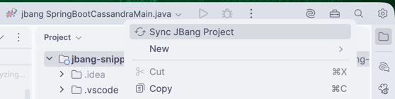

# Short java/kotlin/scala snippets

## Scope

It is mainly to get conformable with jbang.

## Snippets

1. Deserialize jsonc (JSON with comments) using jackson databind: [v3](JsoncJacksonV3Main.java) & [v2](JsoncJacksonV2Main.java)
2. jbang for [JUnit 5](JUnit5RunnerMain.java) 
3. jbang for [SpringBoot 4.1 app](SbMain.java) 
4. jbang for [SpringBoot 4.1 app](sb/SbAppMain.java) along with the [SpringBoot IT](sb/SbTestsMain.java)
5. jbang for [SpringBoot 4.0, java 21 app with Cassandra](./sbc/SpringBootCassandraMain.java)

## How to run the jbang snippets

- Run a simple java script
```shell
jbang JsoncJacksonV3Main.java
````

- Run SpringBootApplication app
```shell
jbang sb/SbAppMain.java
```

- Run SpringBootTest integration tests
```shell
jbang sb/SbTests.java
```

- Run a simple Groovy script
```shell
jbang SimpleReadFileMain.groovy
```

- Run a Kotlin script with Arrow Effects (Raise) and Context Parameters
```shell
jbang SimpleArrowMain.kt
```

- Run a SpringBoot 4.0 and Java 21 Cassandra Application

```shell
cd sbc
docker compose up -d
jbang SpringBootCassandraMain.java
```

## More snippets

See [TODO](./TODO.md)

## HOWTOs

- How to handle false positives in IDEA
There are cases when even if the jbang (run from IDEA) succeeded, there are red false positives in the editor.
For this case the following IDEA action is the saviour.



## Miscellaneous

- The best support for JBang is in IntellJ Idea.

## References

- [jbang directives](https://www.jbang.dev/documentation/jbang/latest/script-directives.html)
- [jbang file organization](https://www.jbang.dev/documentation/jbang/latest/organizing.html)
- [jbang multiple languages - kotlin](https://www.jbang.dev/documentation/jbang/latest/multiple-languages.html#kotlin-scripts-kt-experimental)
- [jbang JVM options](https://www.jbang.dev/documentation/jbang/latest/execution-options.html#jvm-options-and-flags)

